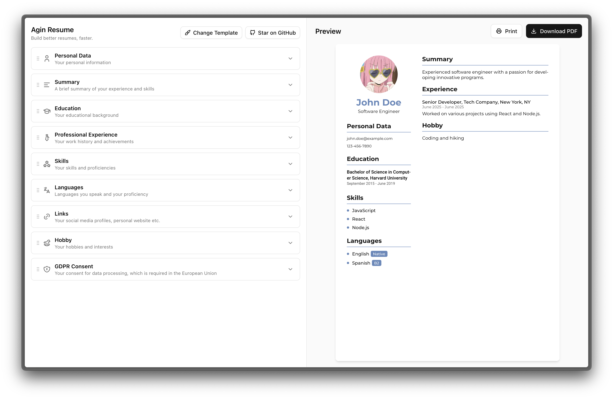

# Agin Resume



Agin Resume is an open source resume builder written in Next.js. Create beautiful, professional resumes with live preview and PDF export.

## Features

-   ✏️ **Live editing** with real-time preview
-   🎨 **Multiple templates** (Modern, Modern-2, Simple)
-   📷 **Photo upload** with cropping functionality
-   🌐 **Multi-language support** _(coming soon!)_
-   🔗 **Social links** support
-   💾 **PDF export** with print support
-   📱 **Responsive design** for mobile and desktop
-   🧰 **Drag and drop** section management _(coming soon!)_

More features coming soon!

## Demo

You can try the app live at: [resume.agin.rocks](https://resume.agin.rocks)

## Roadmap

-   [x] Core resume editing features
-   [x] Live PDF preview
-   [x] Multiple resume templates
-   [x] Photo upload with cropping
-   [x] Skills management
-   [x] Experience and education sections
-   [x] Social links integration
-   [x] PDF export and printing
-   [x] Responsive design
-   [ ] Template customization
-   [ ] Resume sharing links
-   [ ] Custom sections
-   [ ] Multi-language support
-   [ ] Import from LinkedIn
-   [ ] Sections reordering
-   [ ] Saving as JSON

## Building locally

To build the app locally, first clone the repo and `cd` into the folder.

Install dependencies by running:

```bash
pnpm install
```

### Development mode

```bash
pnpm dev
```

The app will be available at `http://localhost:3000`.

### Building for production

```bash
pnpm build
pnpm start
```

## Tech Stack

-   **Framework:** Next.js 15
-   **UI:** React 19, Tailwind CSS, Shadcn UI
-   **PDF Generation:** @react-pdf/renderer
-   **Forms:** React Hook Form, Zod validation
-   **State Management:** Jotai
-   **Image Processing:** react-advanced-cropper
-   **Typography:** Montserrat, Roboto fonts

## Project Structure

```
components/
├── editor/          # Main resume editor
│   ├── core/        # Form sections and editing
│   └── preview/     # PDF preview functionality
├── renderer/        # PDF template rendering
│   └── templates/   # Resume templates (Modern, Simple, etc.)
├── cropper/         # Image cropping functionality
└── ui/              # Reusable UI components

lib/
├── resume-schema.ts # Zod schema for resume data
├── fonts.ts         # Font configuration
└── utils.ts         # Utility functions
```

## Templates

Currently available templates:

-   **Modern** - Professional template with sidebar layout
-   **Modern-2** - Clean template with accent colors
-   **Simple** - Minimalist single-column layout

## Contributing

We welcome contributions!

## License

This project is licensed under the GPL-3.0 License - see the [LICENSE](LICENSE) file for details.
